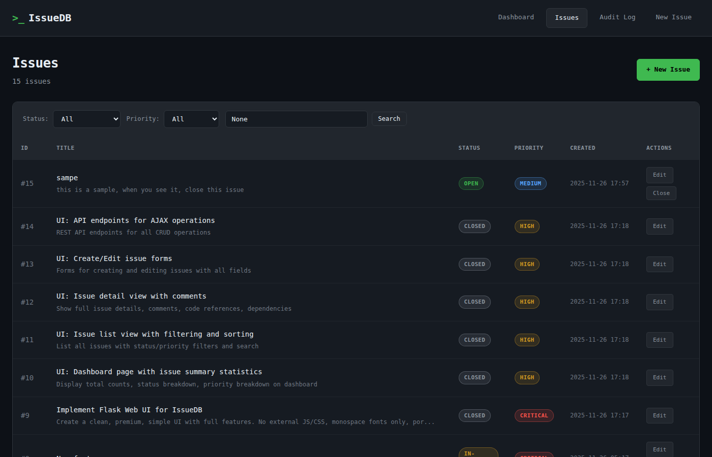
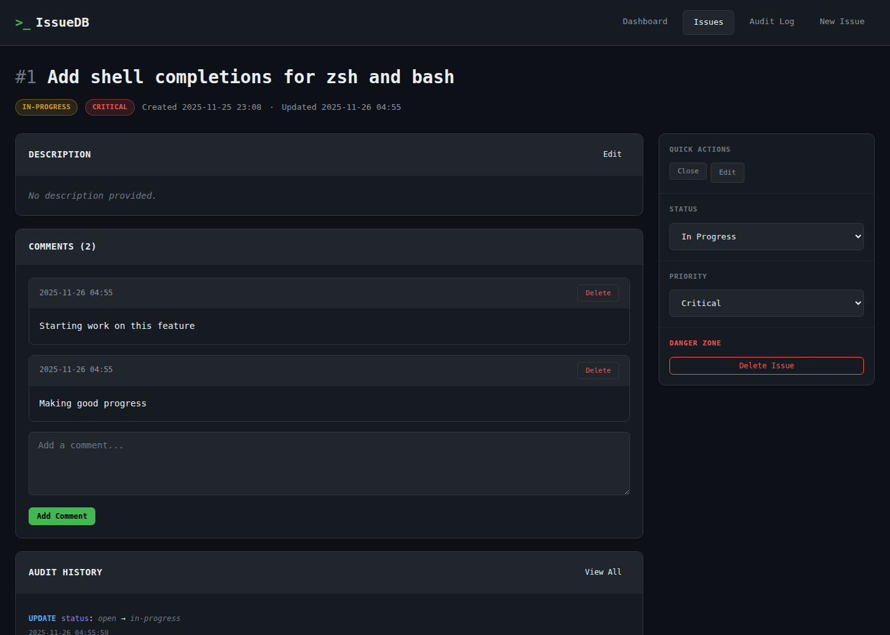
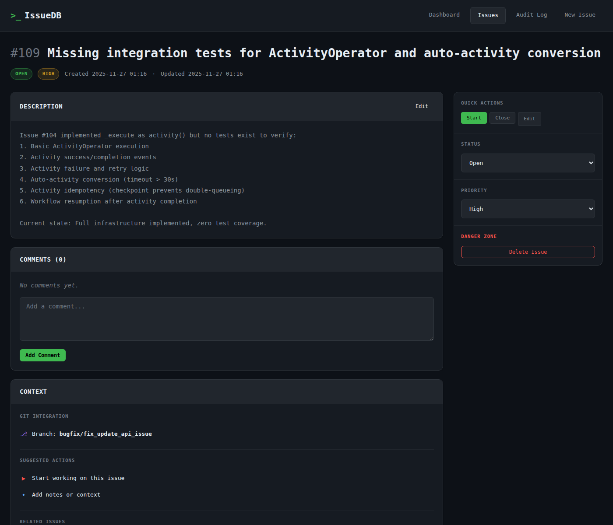
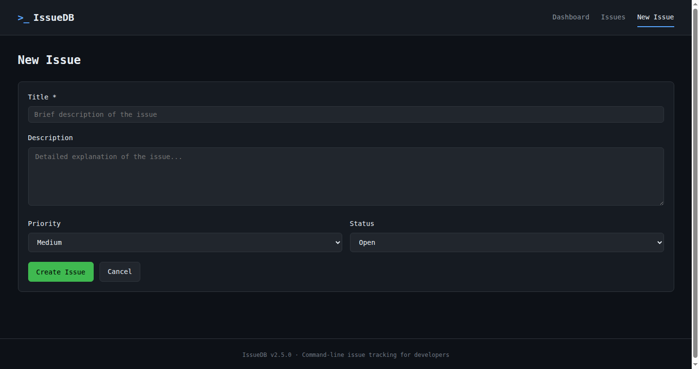
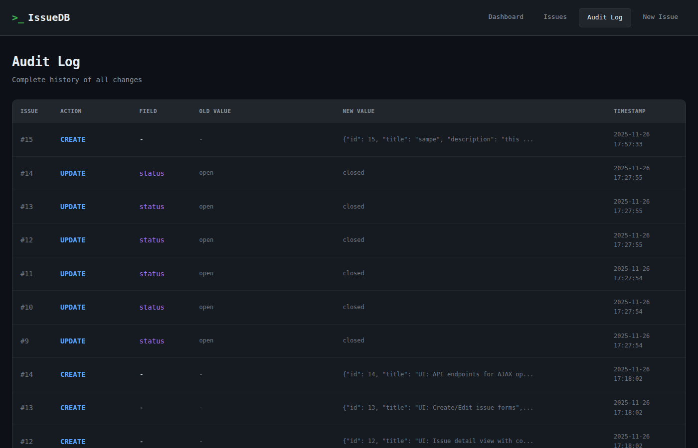

# IssueDB

A command-line issue tracking system for software development projects. IssueDB provides a simple yet concrete way to manage issues, bugs, and tasks directly from your terminal with a **per-directory database model** - each directory gets its own issue database.

## Installation

```bash
pip install issuedb
```

For Web UI support:

```bash
pip install issuedb[web]
```

## Quick Start

```bash
# Create an issue
issuedb-cli create -t "Fix login bug" --priority high

# List open issues
issuedb-cli list -s open

# Get the next issue to work on
issuedb-cli get-next
```

## Usage

### Issue Management

```bash
# Create
issuedb-cli create -t "Add feature X" -d "Description..." --priority high --tag v1.0

# List
issuedb-cli list
issuedb-cli list -s open -p critical
issuedb-cli list --tag v1.0

# Get details
issuedb-cli get 1

# Update
issuedb-cli update 1 -s in-progress
issuedb-cli update 1 --due-date 2025-12-31

# Delete
issuedb-cli delete 1
```

### Web Interface

Start the local web server to manage issues visually.

```bash
issuedb-cli web
```


*Dashboard with statistics and active issue tracking*


*Issues list with filtering and search*


*Issue detail with comments, links, and history*


*Extended issue detail view*


*Create new issue form*


*Complete audit log of all changes*

### Advanced Features

```bash
# Memory (Agent Context)
issuedb-cli memory add "project_style" "PEP8"
issuedb-cli memory list

# Lessons Learned
issuedb-cli lesson add "Always validate input" -c security
issuedb-cli lesson list

# Tagging
issuedb-cli tag add 1 bug frontend
issuedb-cli list --tag bug

# Dependencies
issuedb-cli block 5 --by 3
issuedb-cli deps 5

# Time Tracking
issuedb-cli timer-start 1
issuedb-cli timer-stop
issuedb-cli time-report

# Code References
issuedb-cli attach 1 --file "src/main.py:42"
issuedb-cli refs 1

# Audit Log
issuedb-cli audit -i 1
```

## LLM Agent Integration

IssueDB is designed for AI agents. Use the prompt guide:

```bash
issuedb-cli --prompt
```

Or use the JSON output format for all commands:

```bash
issuedb-cli --json list
```

## License

Apache License 2.0