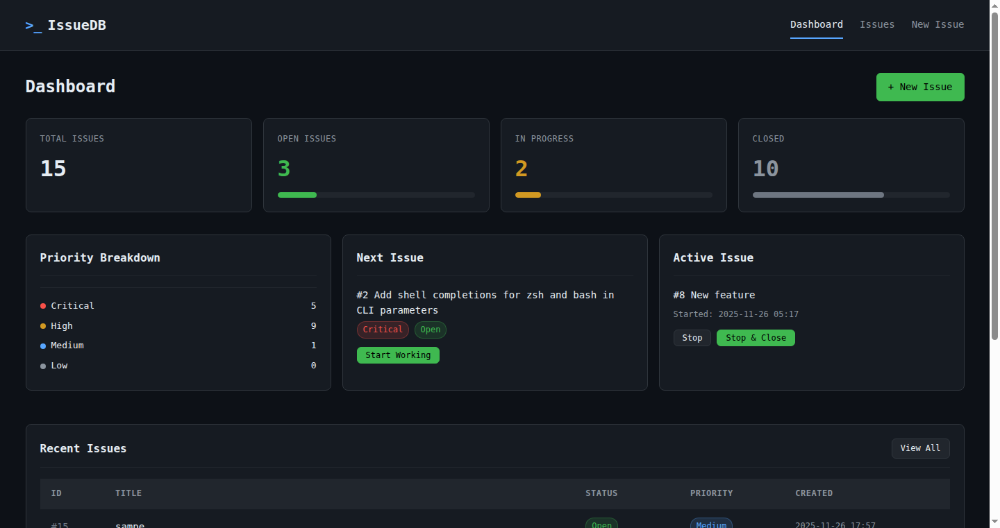
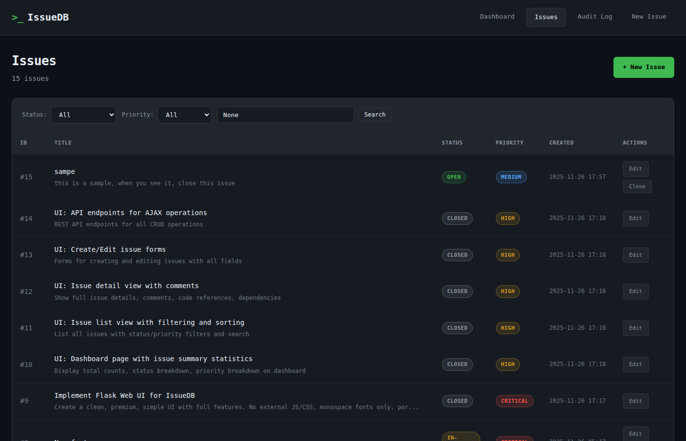
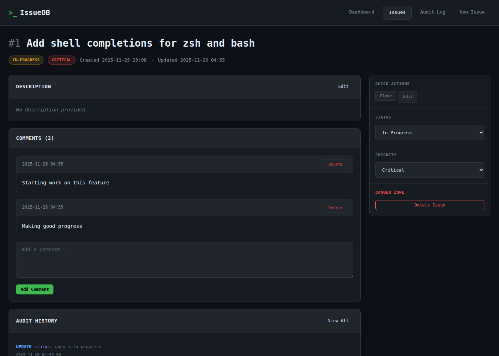
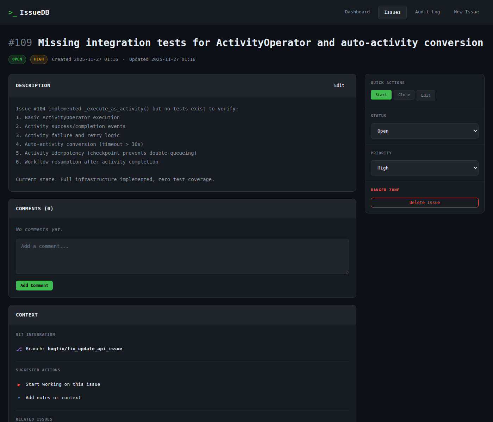
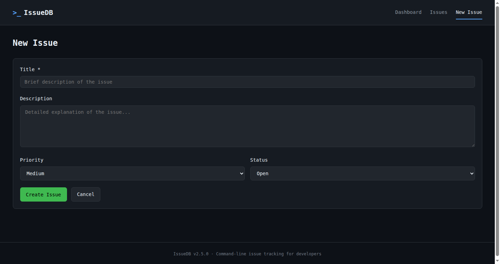
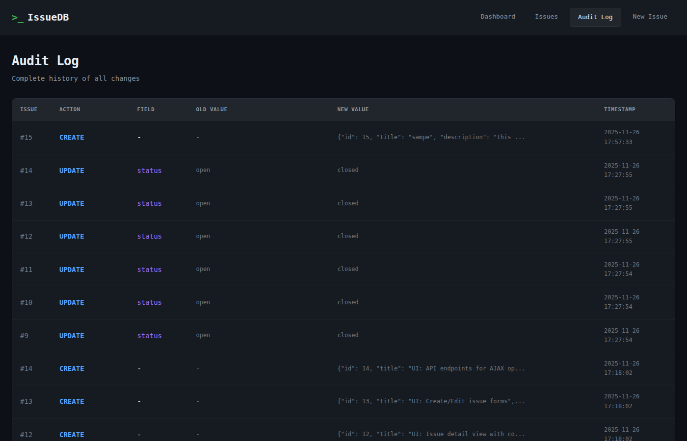

# IssueDB

[](https://github.com/rodmena-limited/issue-queue/actions/workflows/ci.yml)
[](https://pypi.org/project/issuedb/)
[](https://pypi.org/project/issuedb/)

A command-line issue tracking system for software development projects. IssueDB provides a simple yet concrete way to manage issues, bugs, and tasks directly from your terminal with a **per-directory database model** - each directory gets its own issue database.

## Installation

Requires Python 3.9+.

```bash
pip install issuedb
```

For Web UI support:

```bash
pip install issuedb[web]
```

## Quick Start

```bash
# Create an issue
issuedb-cli create -t "Fix login bug" --priority high

# List open issues
issuedb-cli list -s open

# Get the next issue to work on
issuedb-cli get-next
```

## Usage

### Issue Management

```bash
# Create
issuedb-cli create -t "Add feature X" -d "Description..." --priority high --tag v1.0

# List
issuedb-cli list
issuedb-cli list -s open -p critical
issuedb-cli list --tag v1.0

# Get details
issuedb-cli get 1

# Update
issuedb-cli update 1 -s in-progress
issuedb-cli update 1 --due-date 2025-12-31

# Delete
issuedb-cli delete 1
```

### Web Interface

Start the local web server to manage issues visually.

```bash
issuedb-cli web
```

The server binds to `127.0.0.1` (localhost) by default. To expose it on your network,
pass `--host 0.0.0.0` explicitly. Cross-origin state-changing requests are rejected as a
CSRF safeguard.


*Dashboard with statistics and active issue tracking*


*Issues list with filtering and search*


*Issue detail with comments, links, and history*


*Extended issue detail view*


*Create new issue form*


*Complete audit log of all changes*

### Advanced Features

```bash
# Memory (Agent Context)
issuedb-cli memory add "project_style" "PEP8"
issuedb-cli memory list

# Lessons Learned
issuedb-cli lesson add "Always validate input" -c security
issuedb-cli lesson list

# Tagging
issuedb-cli tag add 1 bug frontend
issuedb-cli list --tag bug

# Dependencies
issuedb-cli block 5 --by 3
issuedb-cli deps 5

# Time Tracking
issuedb-cli timer-start 1
issuedb-cli timer-status
issuedb-cli timer-stop        # no argument: stops ALL running timers
issuedb-cli timer-stop 1      # stop the timer for issue 1
issuedb-cli estimate 1 2.5
issuedb-cli time-log 1
issuedb-cli time-report --period week

# Templates
issuedb-cli templates
issuedb-cli create --template bug -t "Crash on startup" -d "Steps: ..."

# Git integration
issuedb-cli git-status
issuedb-cli git-link 1 -c <commit-hash>
issuedb-cli git-links 1
issuedb-cli git-scan --auto-close   # link commits mentioning "#N"; close "fixes #N"

# Code References
issuedb-cli attach 1 --file "src/main.py:42"
issuedb-cli refs 1
issuedb-cli detach 1 --file "src/main.py"
issuedb-cli affected "src/main.py"

# Similar issues & duplicates
issuedb-cli find-similar "login button broken"
issuedb-cli dedupe

# Bulk operations by pattern (glob by default, --regex for regex)
issuedb-cli bulk-close-pattern --title "legacy *" --dry-run
issuedb-cli bulk-update-pattern --title "v1 *" -s closed
issuedb-cli bulk-delete-pattern --title "tmp *" --confirm

# Bulk-update guards against touching every issue: a filter is required,
# or pass --all to confirm an unfiltered update.
issuedb-cli bulk-update --filter-status open -s in-progress

# Audit Log
issuedb-cli audit -i 1
```

## LLM Agent Integration

IssueDB is designed for AI agents. Use the prompt guide:

```bash
issuedb-cli --prompt
```

Or use the JSON output format for all commands:

```bash
issuedb-cli --json list
```

## Continuous Integration

Every push and pull request is validated by GitHub Actions
([`.github/workflows/ci.yml`](.github/workflows/ci.yml)):

- **test** — the full test suite on Python 3.9–3.14, with the `[web]` extra
  installed so the Flask Web UI/API tests run.
- **lint & type-check** — `ruff check .` and `mypy issuedb`.
- **build & verify dist** — `python -m build` plus `twine check`.

Publishing to PyPI is automated by
[`.github/workflows/release.yml`](.github/workflows/release.yml): publishing a
GitHub Release tagged `v<version>` re-runs the tests, checks that the built
version matches the tag, and uploads to PyPI via OIDC Trusted Publishing. See
[docs/contributing.rst](docs/contributing.rst) for the one-time Trusted
Publisher setup.

Run the same gates locally:

```bash
pip install -e ".[web]" pytest
ruff check . && mypy issuedb && pytest
```

## License

Apache License 2.0